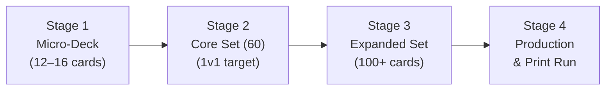

# Staged Scaling Framework

Scaling your card pool should follow an iterative pipeline. Do not design all 60+ cards at once; start with the minimum number needed to test the core turn structure.

## Stage 1: Micro-Deck (12–16 Cards total)

Goal: Validate the core mechanics (Exposure → Infection → Replication → Immune Response → Progression) without clutter.
Pathogen Deck (6–8 cards):
2 Bacteria (E. coli with balanced stats; S. aureus with high Persistence)
1 Virus (Requires host cell replication rule)
2 Virulence/Replication Action Cards
1 Resistance/Evasion Card
Host Deck (6–8 cards):
2 Innate Immune Cards (Neutrophil, Macrophage)
2 Diagnostics (Gram Stain, Culture)
2 Treatments (Broad-spectrum Antibiotic, Supportive Care)
Validation Checkpoint: Can the Host contain or clear the pathogen? Does the Disease Track increment predictably? Does the Biology Phase auto-replication feel smooth?

## Stage 2: Core Alpha Set (60 Cards total)

Expand to the full 30-card Pathogen / 30-card Host Deck outlined in Section 7 of your design document.
| Deck | Card Sub-Type | Target Count | Key Mechanics to Test |
| --- | --- | ---: | --- |
| Pathogen | Base Pathogens | 10 | Varied stats (high Evasion vs. high Virulence), Gram+/- representation |
| Pathogen | Transmission | 5 | Route-based entry into specific anatomical zones (GI, Respiratory, Blood) |
| Pathogen | Virulence Factors | 5 | Direct Disease Track progression and Tissue Damage |
| Pathogen | Replication/Evolution | 5 | Population spikes and stat upgrades |
| Pathogen | Resistance/Support | 5 | Neutralizing host treatments |
| Host Defense | Innate Immunity | 8 | Immediate, broad population reduction |
| Host Defense | Adaptive Immunity | 6 | High clearance targeting specific pathogen markers |
| Host Defense | Diagnostics | 5 | Revealing pathogen traits/stats to enable targeted play |
| Host Defense | Treatments | 6 | Targeted clearance (Antibiotics, Antivirals) |
| Host Defense | Prevention/Support | 5 | Vaccines, organ stability, disease mitigation |

Validation Checkpoint: Are win conditions achievable for both sides? Do stat differences create distinct tactical choices? Are response windows interactive without stalling gameplay?

## Stage 3: Expansion & Archetype Variety (100+ Cards)

Once the 60-card Core Set is balanced, expand the mechanical breadth:
Specialized Pathogen Classes: Fungi, Parasites, Prions (introducing unique mechanics like slow progression or extreme persistence).
Synergy & Combos: Opportunistic superinfections, cytokine storms, complex diagnostic panels.
Environmental / Host Events: Immunocompromised states, hospital settings, public health interventions.

## Stage 4: Polish & Mass Production

Visual Polish: Replace placeholder UI with finalized icon sets for stats, anatomical locations, and transmission routes.
POD Testing: Order a physical prototype deck from Print-on-Demand services like MakePlayingCards (MPC) or DriveThruCards to evaluate card stock, color contrast, and text legibility.
Which approach do you prefer for your first iteration: crafting paper-and-sleeve physical cards or setting up a spreadsheet template for digital generation?